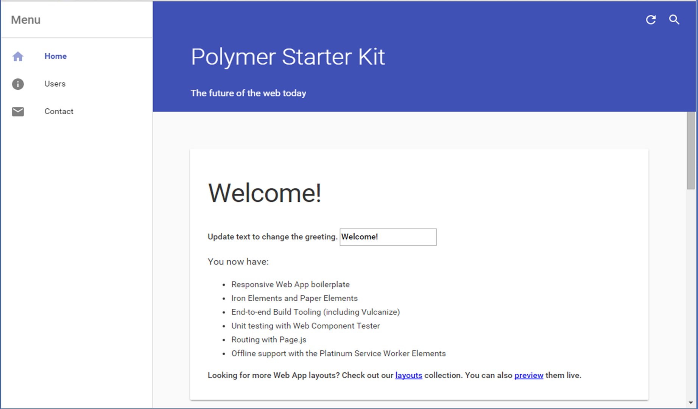
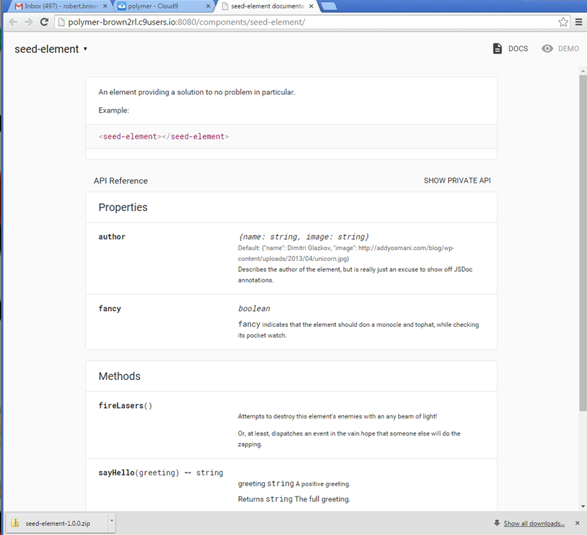
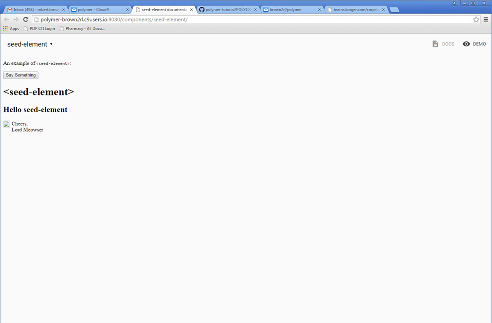
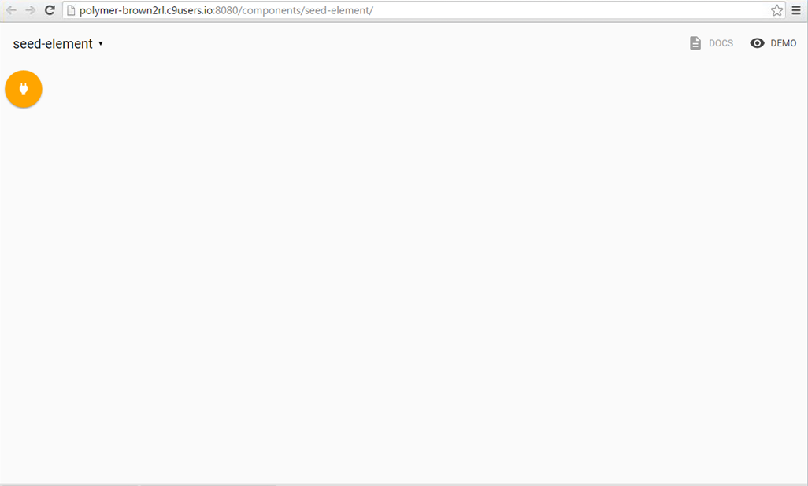
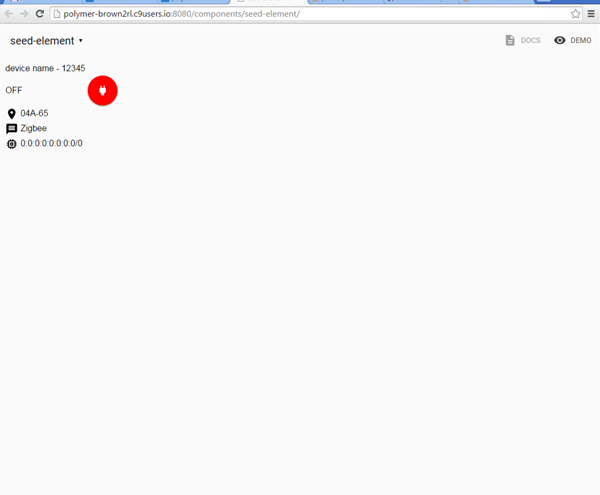
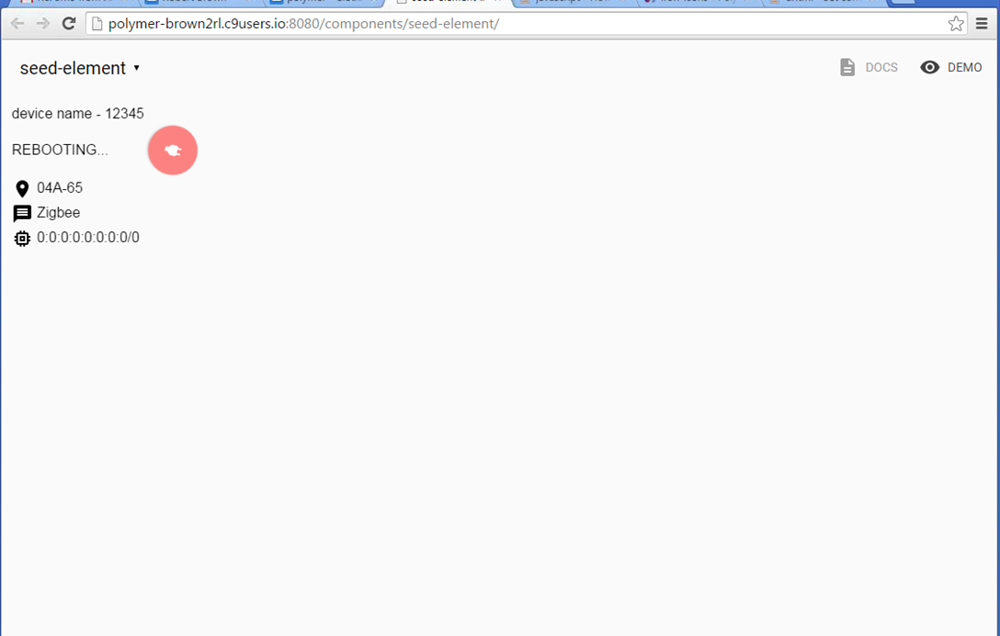
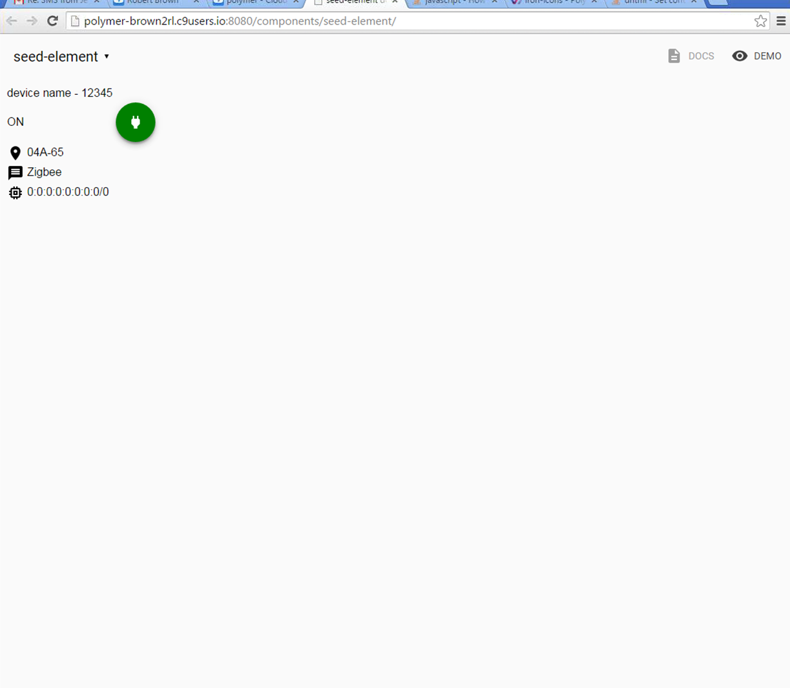

## setting up

1. Download and the Full Intermediate Starter Kit and its dependancies from the link in 101.  Alternatively,
```
$ git clone https://github.com/polymerelements/polymer-starter-kit.git
```
3. install bower components in the new directory
```
$ bower install
```
4. make sure bower_components is in app/ (otherwise gulp will not build correctly)

5. check to see that the fresh installation is served correctly (using Chrome). if you need to change ports, go to ```node_modules/browser-sync/lib/default-config.js``` and change from 3001 (for browserSync UI) and ```project/gulpfile.js``` from 5001 (line 220 for PSK UI)
```
$ gulp && gulp serve
```
6. if all goes well, you should have an output that looks like this:


7. here's the breakdown of the project directory/starter kit.. it's the larger system in which we will integrate our custom element:

- app/ is where you store all of your source code and do all of your development.
- elements/ is where you keep your custom elements.
- images/ is for static images.
- scripts/ is the place for JS scripts.
- styles/ houses your app’s shared styles and CSS rules.
- test/ is where you define tests for your web components.
- docs/ contains optional “recipes” (how-to guides) for adding features to your application or for using optional tools or editors.
- dist/ is the directory to deploy to production. When you run the build task, files are prepared for production (HTML imports are vulcanzied, scripts are minimized, and so on) and output to this directory.

## creating our element
In order to create our custom element, we're going to utilize the seed element and polyserve.
The seed element gives us the ablity to create and test reusable elements with a localized version of Polymer in order 
to integrate it into the larger system. It also allows us to create API documentation on the fly.
### setting up
1. download/unzip or clone [the seed element](https://www.polymer-project.org/1.0/docs/start/reusableelements.html) into app/elements
2. install polyserve globally ```npm install -g polyserve```
3. ```bower install``` for your components (may have to include them in demo and test)
4. run ```polyserve``` or ```polyserve -p 9999``` if you need a different port (for C9 users, be sure to ```polyserve -H 0.0.0.0```)
5. if all goes well, you should see a landing page looking like the following:



### adding some better stuff
- open seed-element.html from ```project/seed-element```
- we're going to remove the contents of the element, and add a button to represent restarting a particular device
- lets start by deleting the contents of ```<style></style>``` and ```<template></template>``` so that the HTML looks like (without ```<script></script>```)
```
<link rel="import" href="../polymer/polymer.html">
<link rel="import" href="../paper-fab/paper-fab.html">
<link rel="import" href="../iron-icons/notification-icons.html">

<!--
An element representing the restart signal for a device

Example:

    <seed-element></seed-element>

@demo
-->
<dom-module id="seed-element">

  <style>
    paper-fab {
      --paper-fab-background: orange; // init & rebooting state
    }
  </style>

  <template>
    <paper-fab icon="notification:power"></paper-fab>
  
  </template>

</dom-module>
```
- next, we'll open up the contents of ```project/seed-element/demo/index.html```.  this is what is displayed when we click "demo" at the top right after we serve the page
- notice the assignment in the ```author``` custom attribute is an object that is passed to the Polymer function in ```seed-element.html```
- remove the extraneos stuff in the ```<body>```, ```<seed-element>```, and ```<script>``` so that we only have the following:
```
<html>
  <head>
    <meta charset="utf-8">
    <meta name="viewport" content="width=device-width, minimum-scale=1.0, initial-scale=1.0, user-scalable=yes">
    <title>seed-element Demo</title>
    <script src="../../webcomponentsjs/webcomponents-lite.js"></script>
    <link rel="import" href="../seed-element.html">
  </head>
  <body>

    <seed-element>
      
    </seed-element>

    <script>
 
    </script>

  </body>
</html>
```
- now, when we run ```polyserve``` and click demo, we get something looking like


- this brings us to the design decision of how to represent device power state with the button.
- while we are thinking about that, let's remove the extraneos info from the Polymer script in ```seed-element.html``` and add a listener for a click
```
<script>

  Polymer({

    is: 'seed-element',

    handleClick: function() {
        // alert for a status
        alert('restarting device...');
        // change color to green for device on state
        document.getElementsByTagName("paper-fab")[0].setAttribute("class","device-on");
      }


   
  });

</script>
```
- .. and amend our element to represent a loading state (green - on & red - off/error) with some properties
```
<dom-module id="seed-element">

  <style>
    paper-fab {
      background: orange; // init & rebooting state
    }
  </style>

  <template>
    <paper-fab id="device-power" onclick="restart()" icon="notification:power"></paper-fab>
  
  </template>

</dom-module>
<script>

  Polymer({

    is: 'seed-element',
    
        
  properties: {
    device_id: Number,
    device_name: String,
    location: String
   }
    
  });
  
  function rotateOut() {
    var elem = document.querySelector('.restart');
    var transformOrigin = elem.style['transform-origin'];
    var keyframes = [
      {transform: 'none', opacity: '1', transformOrigin: 'center', offset: 0}, 
      {transform: 'rotate3d(0, 0, 1, 200deg)', opacity: '0', transformOrigin: 'center', offset: 1}
    ];
    var timing = {duration: 900, iterations: 3}; // change 3 to Infinity when we have a signal
    // random number gen since we don't have a real signal yet.
    var state = Math.floor(((Math.random()*10)+1) % 2);
    
    elem.animate(keyframes, timing);
    var rotate = elem.animate(keyframes, timing); 
    
    //send restart signal here & call rotate.finish() when signal recieved or timed out
    
    
    
    rotate.onfinish = function() {
    // device powered on.. we'll want to detect timeout and color red
      state == 0 ? elem.style.background = "green" : elem.style.background = "red";
    }
  }
</script>
```
- also, notice that we've added a random number generator to simulate the off and on states based upon the modulo operator
- let's start exploring our element's properties.  currently we know that devices have a name, and id, and a location at least.  it may also be helpful to add a protocol and an address.  to add properties, we define a field named "properties" and populate that with the names and type that we will be displaying within our element.  because some of these are mutable (change) we want to give the notify field so that we can update the element once the property's value changes.
```
  Polymer({

    is: 'seed-element',
    
    properties: {
      device_id: Number,
      device_name: {
        type: String,
        notify: true
      },
      location: {
        type: String,
        notify: true
      },
      protocol: {
        type: String,
        notify: true
      },
      address: {
        type: String,
        notify: true
      }
    }
    
  });
```
- now that we have the properties, let's add some default values
 ```
properties: {
      device_id: {
        type: Number,
        notify: true,
        value: 12345
      },
      device_name: {
        type: String,
        notify: true,
        value: 'device name'
      },
      location: {
        type: String,
        notify: true,
        value: '04A-65'
      },
      protocol: {
        type: String,
        notify: true,
        value: 'Zigbee'
      },
      address: {
        type: String,
        notify: true,
        value: '0:0:0:0:0:0:0:0/0'
      }
    }
```
- after a good amount of testing, we should now be able to add some of our icons and a text state that corresponds with your paper fab with a little tweak on the animation and html for your final custom element:
```
<dom-module id="seed-element">

  <style>
    paper-fab {
      background: orange; // init & rebooting state
    }
    iron-label {
      font-family: arial;
    }
  </style>

  <template>
    
    <iron-label id="device-meta">
      <table>
        <tr>
          <td>
            {{device_name}} - {{device_id}}
          </td>
        </tr>
        <tr>
          <td>
            <span id='status'></span>
          </td>
          <td>
             <paper-fab class="restart" id="device-power" onclick="rotateOut()" icon="notification:power"></paper-fab>
          </td>
          <td>
            <tr>
             <td><iron-icon icon="maps:place"></iron-icon> {{location}}</td>
            </tr>
            <tr>
              <td><iron-icon icon="communication:message"></iron-icon> {{protocol}}</td>
            </tr>
            <tr>
              <td><iron-icon icon="hardware:memory"></iron-icon> {{address}}</td>
            </tr>
          </td>
        </tr>
      </table>
    </iron-label>
    </table>
  </template>

</dom-module>
<script>

  Polymer({

    is: 'seed-element',
    
    properties: {
      device_id: {
        type: Number,
        notify: true,
        value: 12345
      },
      device_name: {
        type: String,
        notify: true,
        value: 'device name'
      },
      location: {
        type: String,
        notify: true,
        value: '04A-65'
      },
      protocol: {
        type: String,
        notify: true,
        value: 'Zigbee'
      },
      address: {
        type: String,
        notify: true,
        value: '0:0:0:0:0:0:0:0/0'
      }
    }
  });
  
  function rotateOut() {
    var elem = document.querySelector('.restart');
    var status = document.querySelector('#status')
    var transformOrigin = elem.style['transform-origin'];
    var keyframes = [
      {transform: 'none', opacity: '1', transformOrigin: 'center', offset: 0}, 
      {transform: 'rotate3d(0, 0, 1, 200deg)', opacity: '0', transformOrigin: 'center', offset: 1}
    ];
    var timing = {duration: 900, iterations: 3};// change 3 to Infinity when we have a signal
    // random number gen since we don't have a real signal yet.
    var state = Math.floor(((Math.random()*10)+1) % 2);
    
    elem.animate(keyframes, timing);
    status.textContent = "REBOOTING...";
    var rotate = elem.animate(keyframes, timing); 
    //send restart signal here & call rotate.finish() when signal recieved or timed out

    
    rotate.onfinish = function() {
    // conditional for state styling based on even (green) & odd (red)
      if (state == 0) {
        elem.style.background = "green";
        status.textContent = "ON";
      } else {
        elem.style.background = "red";
        status.textContent = "OFF";
      }
    };
  }
</script>
```
- if you copy the above, and replace it for your final work, and all goes well, you should have something looking like the following:



---
data binding video inspiration: [data binding vid](https://youtu.be/1sx6YNn58OQ)


- parses HTML for {{}} child component -> parent component data and [[]] parent component -> child component data and makes property effects
- $0._propertyEffects to inspect property effects in chrome
- gets ```set function() {}``` in ```Polymer({})``` for:
	 "dirty checking" ( data value diffing & chacing )
	 running property effects
	 listeining to changed events
- _setFoo = private setter
- setting readonly

